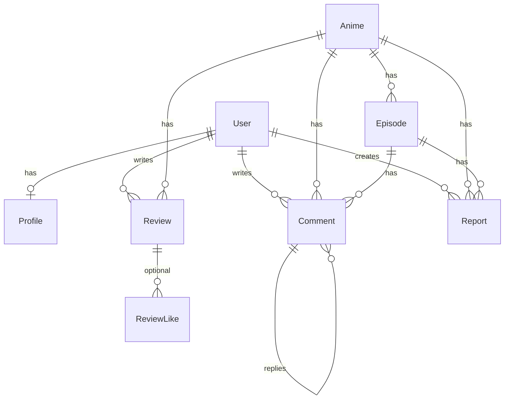

# AnimeModu v2 - Proje Bilgi Haritası

> **Son Güncelleme:** 2026-01-13 (Livewire 4 + Filament 5 Beta Upgrade)
> 
> Bu belge, projenin tüm yapısını detaylı şekilde dokümante eder.

---

## 📊 Tech Stack

| Bileşen | Teknoloji | Versiyon | Not |
|---------|-----------|----------|-----|
| **Framework** | Laravel | 12.x | |
| **PHP** | PHP | 8.2+ | Strict Mode |
| **Admin Panel** | FilamentPHP | **5.0-beta9** | 🔥 Beta |
| **Frontend** | Livewire | **4.0-beta.6** | 🔥 Beta |
| **CSS** | Tailwind CSS | 4.x | |
| **Build Tool** | Vite | 7.x | |
| **Database** | SQLite (Dev) / PostgreSQL (Prod) | - | |
| **Static Analysis** | Larastan | 3.0 | |
| **Code Style** | Laravel Pint | 1.24+ | |

> ⚠️ **Beta Uyarısı:** Livewire 4 + Filament 5 beta sürümleri kullanılıyor. Stable: 2026 Q1

---

## 🔮 Filament 5 Namespace Değişiklikleri

Filament 5, Livewire 4 ile uyumluluk için bazı namespace değişiklikleri içeriyor:

| Eski (v4) | Yeni (v5) |
|-----------|-----------|
| `Filament\Forms\Form` | `Filament\Schemas\Schema` |
| `Filament\Forms\Set` | `callable $set` |
| `Filament\Tables\Actions\EditAction` | `Filament\Actions\EditAction` |
| `Filament\Tables\Actions\BulkActionGroup` | `Filament\Actions\BulkActionGroup` |
| `Filament\Tables\Actions\DeleteBulkAction` | `Filament\Actions\DeleteBulkAction` |

**Güncellenen dosyalar:**
`HasAnimeForm.php`, `HasAnimeTable.php`, `HasEpisodeTable.php`, `CommentResource.php`, `GenreResource.php`, `MovieResource.php`, `PageResource.php`, `ReportResource.php`, `UserResource.php`

---

## 📁 Klasör Yapısı

```
animemoduv2/
├── app/
│   ├── Actions/           # İş mantığı sınıfları
│   │   ├── Anime/
│   │   │   ├── ImportAnimeAction.php    # TMDB'den anime import
│   │   │   └── SyncCharactersAction.php # AniList karakter sync
│   │   ├── CreateCommentAction.php      # DDD: Yorum oluşturma
│   │   ├── CreateReviewAction.php       # DDD: İnceleme oluşturma
│   │   ├── PinCommentAction.php         # DDD: Yönetici sabitleme
│   │   └── ToggleCommentLikeAction.php  # DDD: Beğeni/Dislike yönetimi
│   ├── Enums/
│   │   └── AnimeStatus.php  # ONGOING, COMPLETED
│   ├── Filament/           # Admin panel kaynakları
│   │   ├── Pages/
│   │   └── Resources/      # 8 adet resource
│   ├── Http/Controllers/   # Boş (Livewire kullanılıyor)
│   ├── Livewire/           # Full-page components
│   │   ├── Anime/
│   │   │   ├── CastList.php
│   │   │   ├── Comments.php # Refaktör: Actions/Service tabanlı, Dislike & Quote Support
│   │   │   ├── DetailsHero.php
│   │   │   ├── EpisodeList.php
│   │   │   ├── HomeHero.php
│   │   │   └── Show.php
│   │   ├── Auth/
│   │   │   ├── AuthModal.php
│   │   │   └── Concerns/
│   │   │       └── HasAuthModalConfig.php # Modal konfigürasyonları (Trait)
│   │   ├── Layout/
│   │   │   ├── NavbarSearch.php
│   │   │   └── UserMenu.php
│   │   └── Pages/
│   │       └── Home.php
│   ├── Models/             # 8 model (Comment: recursive replies)
│   ├── Providers/
│   └── Services/           # İş mantığı ve Dış API servisleri
│       ├── AnilistService.php
│       ├── CommentService.php  # DDD: Yorum/İnceleme sorgu mantığı
│       └── TmdbService.php
├── database/migrations/    # 12 migration
├── resources/
│   ├── css/app.css         # Tailwind theme + no-scrollbar utility
│   ├── js/app.js
│   └── views/
│       ├── components/     # 31 Blade component
│       │   ├── anime/      # 9 component
│       │   ├── icons/      # 16 icon
│       │   ├── layout/     # 4 component
│       │   └── ui/         # 3 component
│       ├── home/           # 3 component (LatestEpisodes, RecentAnimes, PopularMovies)
│       ├── filament/
│       └── livewire/       # Livewire views
│           └── anime/
│               └── partials/
│                   ├── comment-item.blade.php # Recursive, Supports [quote] parsing, Amber badges
│                   ├── comments-tabs.blade.php
│                   ├── comments-input.blade.php
│                   └── comments-empty-state.blade.php
└── routes/
    └── web.php             # 2 route
```

---

## 🗄️ Database Schema

### Relationships Diagram



### Models

#### `User` (users)
| Field | Type | Notes |
|-------|------|-------|
| id | UUID | Primary |
| name | string | |
| email | string | Unique |
| password | hashed | |
| email_verified_at | datetime | |

**Relationships:** `hasOne(Profile)`, implements `FilamentUser`
**Methods:** `isAdmin()`, `canAccessPanel()`

---

#### `Profile` (profiles)
| Field | Type | Notes |
|-------|------|-------|
| user_id | UUID | Primary, FK |
| username | string | Unique |
| full_name | string | |
| avatar_url | string | Default: `/default-avatar.webp` |
| banner_url | string | Default: `/banner-placeholder.webp` |
| bio | text | |
| location | string | |
| social_media | JSON | |
| age | string | |
| role | string | Default: `user` |

**Relationships:** `belongsTo(User)`
**Security:** `role` NOT in `$fillable` (güvenlik)

---

#### `Anime` (animes)
| Field | Type | Notes |
|-------|------|-------|
| id | UUID | Primary |
| tmdb_id | int | Unique |
| anilist_id | int | Unique |
| title | string | |
| original_title | string | |
| overview | text | |
| poster_path | string | TMDB path |
| backdrop_path | string | TMDB path |
| vote_average | decimal(3,1) | |
| vote_count | int | |
| release_date | date | |
| slug | string | Unique |
| media_type | enum | `tv`, `movie` |
| structure_type | enum | `seasonal`, `absolute` |
| status | enum | `AnimeStatus` cast |
| genres | JSON | Array of strings |
| characters | JSON | AniList data |
| is_featured | boolean | Homepage hero |
| trailer_key | string | YouTube key |

**Relationships:** `hasMany(Episode)`
**Indexes:** `slug`, `status`, `created_at`

---

#### `Episode` (episodes)
| Field | Type | Notes |
|-------|------|-------|
| id | UUID | Primary |
| anime_id | UUID | FK → animes |
| tmdb_id | int | |
| title | string | |
| overview | text | |
| still_path | string | TMDB path |
| vote_average | decimal(3,1) | |
| air_date | date | |
| season_number | int | 1, 2, 3... |
| episode_number | int | |
| absolute_episode_number | int | One Piece: 1000+ |
| duration | int | Dakika |
| video_url | string | Video linki |

**Relationships:** `belongsTo(Anime)`

---

#### `Comment` (comments)
| Field | Type | Notes |
|-------|------|-------|
| id | UUID | Primary |
| user_id | UUID | FK → users |
| anime_id | UUID | FK → animes |
| episode_id | UUID | FK → episodes (nullable) |
| parent_id | UUID | Self-referencing FK |
| content | text | |
| is_spoiler | boolean | |
| is_pinned | boolean | |
| like_count | int | |
| dislike_count | int | |

**Relationships:** `belongsTo(User, Anime, Episode)`, `hasMany(CommentLike)`

---


#### `Review` (reviews)
| Field | Type | Notes |
|-------|------|-------|
| id | UUID | Primary |
| user_id | UUID | FK → users |
| anime_id | UUID | FK → animes |
| title | string | Nullable |
| content | text | |
| rating | int | 1-10 |
| is_spoiler | boolean | |
| helpful_count | int | |

**Relationships:** `belongsTo(User, Anime)`

---

#### `Report` (reports)
| Field | Notes |
|-------|-------|
| id | UUID |
| anime_id | FK |
| episode_id | FK (nullable) |
| user_id | FK |
| reason | string |
| description | text |
| status | string |

---

#### `Genre` (genres)
| Field | Notes |
|-------|-------|
| id | UUID |
| name | string |
| slug | string |

---

#### `Page` (pages)
| Field | Notes |
|-------|-------|
| id | UUID |
| title | string |
| slug | string |
| content | text |
| is_active | boolean |

---

## 🔧 Services

### TmdbService
**Path:** `app/Services/TmdbService.php`
**Purpose:** The Movie Database API entegrasyonu

| Method | Cache | Description |
|--------|-------|-------------|
| `search(query)` | 5 dk | Multi-search (TV + Film) |
| `getDetails(id, type)` | 24 saat | Detaylı bilgi + credits + videos |
| `getSeasonDetails(tvId, season)` | 1 saat | Sezon bölümleri |
| `getImageUrl(path, size)` | - | TMDB image URL builder |
| `getTrailerUrl(key)` | - | YouTube URL builder |
| `getYear(date)` | - | Yıl parser |

**Config:** `config('services.tmdb.key')` → `TMDB_API_KEY`

---

### AnilistService
**Path:** `app/Services/AnilistService.php`
**Purpose:** AniList GraphQL API entegrasyonu

| Method | Cache | Description |
|--------|-------|-------------|
| `search(query)` | 5 dk | Anime arama |
| `getCharacters(anilistId)` | 7 gün | Karakter listesi |

---

## ⚡ Actions

### ImportAnimeAction
**Purpose:** TMDB'den detay çeker, anime/bölüm oluşturur ve AniList karakterlerini sync eder.

### SyncCharactersAction
**Purpose:** AniList karakter verilerini anime'ye kaydeder.

### CreateCommentAction & CreateReviewAction
**Purpose:** DDD prensiplerine göre iş mantığını (oluşturma) Livewire bileşeninden ayırır.

### PinCommentAction
**Purpose:** Yorumları sabitleme/kaldırma yetkisi ve mantığı (Admin only).

### ToggleCommentLikeAction
**Purpose:** Yorumları beğenme ve beğenmeme (dislike) işlemi. Atomik sayaç güncellemeleri.

---

## 🖼️ Livewire Components

### Pages
| Component | Route | Layout |
|-----------|-------|--------|
| `Pages\Home` | `/` | `components.layout.app` |

### Anime
| Component | Purpose |
|-----------|---------|
| `Anime\Show` | Anime detay sayfası |
| `Anime\EpisodeList` | Sezon/bölüm listesi (**Snap-X, No-Scrollbar**) |
| `Anime\Comments` | Unified Comment & Review system (**Recursive Threaded Replies**, Admin Pinning, Actions-based) |
| `Anime\DetailsHero` | Information about the anime, trailer, and actions |
| `Anime\HomeHero` | Öne çıkan anime slider |
| `Anime\CastList` | Karakterler horizontal scroll |

### Auth
| Component | Purpose |
|-----------|---------|
| `Auth\AuthModal` | Login/Register/Forgot modal (Trait-based config) |

### Layout
| Component | Purpose |
|-----------|---------|
| `Layout\NavbarSearch` | Arama dropdown |
| `Layout\UserMenu` | Kullanıcı profil menu |

---

## 🎨 Blade Components

### Layout (`components/layout/`)
- `app.blade.php` - Ana layout (HTML, head, body)
- `container.blade.php` - Max-width container
- `navbar.blade.php` - Navigasyon
- `footer.blade.php` - Footer

### Anime (`components/anime/`)
- `hero-card.blade.php` - Slider card
- `episode-card.blade.php` - Bölüm kartı
- `character-card.blade.php` - Karakter kartı
- `trailer-modal.blade.php` - YouTube embed modal
- `watch-status-dropdown.blade.php` - Listeme ekle dropdown
- `rating-circle.blade.php` - Circular rating
- `scroll-button.blade.php` - Sol/sağ scroll butonları

### UI (`components/ui/`)
- `button.blade.php` - Parametrik buton (Premium efektli)
- `input.blade.php` - Form input
- `toast.blade.php` - Custom "Ateş Etmeli" Toast sistemi (Alpine.js)

### Home (`components/home/`)
- `latest-episodes.blade.php` - Son eklenen bölümler gridi
- `recent-animes.blade.php` - Yeni eklenen animeler gridi
- `popular-movies.blade.php` - Popüler filmler gridi

### Icons (`components/icons/`)
21 adet SVG icon component (Refactored: shield-plus/minus, arrows, star-solid)

---

## 🛡️ Filament Admin Panel

**URL:** `/admin` (sadece `role === 'admin'` erişebilir)

### Resources

| Resource | Model | Features |
|----------|-------|----------|
| `AnimeResource` | Anime | Traits: `HasAnimeForm`, `HasAnimeTable` |
| `EpisodeResource` | Episode | Traits: `HasEpisodeForm`, `HasEpisodeTable` |
| `CommentResource` | Comment | |
| `GenreResource` | Genre | |
| `MovieResource` | Anime (movie) | |
| `PageResource` | Page | |
| `ReportResource` | Report | |
| `UserResource` | User | |

### ListAnimes Custom Page
- **TMDB Import Action:** Arama, seçim, structure_type seçimi
- Poster thumbnail ile arama sonuçları

---

## 🎨 Theme System

**Path:** `resources/css/app.css`

### Colors
| Token | Hex | Usage |
|-------|-----|-------|
| `--color-bg-main` | #131720 | Ana arkaplan |
| `--color-bg-secondary` | #151f30 | Kart arkaplanları |
| `--color-bg-dark` | #12141a | Modal/gradient |
| `--color-bg-dropdown` | #1a1f2e | Dropdown |
| `--color-bg-input` | #1e2330 | Form inputs |
| `--color-primary` | #2f80ed | Ana mavi |
| `--color-danger` | #ef4444 | Kırmızı |
| `--color-success` | #22c55e | Yeşil |
| `--color-warning` | #f59e0b | Sarı |
| `--color-orange` | #f97316 | Turuncu |

### Shadows
| Token | Usage |
|-------|-------|
| `shadow-glow` | Primary glow |
| `shadow-glow-lg` | Büyük glow |
| `shadow-orange-glow-lg` | Turuncu büyük glow |
| `shadow-glow-subtle` | Hafif glow |
| `shadow-glow-white` | Beyaz glow |
| `shadow-glow-white-lg` | Beyaz büyük glow |

### Utilities
| Class | Usage |
|-------|-------|
| `.no-scrollbar` | Scrollbar'ları gizler (Modern UI) |
| `.snap-x` | Yatay snap scroll |
| `.snap-mandatory` | Zorunlu snap hizalama |
| `.z-modal` | Modal katmanı (z-100) |
| `.z-toast` | Toast katmanı (z-200) |
| `.text-2xs` | 10px Font boyutu |
| `.aspect-poster` | 2/3 Aspect Ratio |

### Fonts
- **Inter:** Body text
- **Rubik:** Headings

---

## 🛣️ Routes

```php
Route::get('/', Home::class)->name('home');
Route::get('/anime/{slug}', Anime\Show::class)->name('anime.show');
```

**Filament:** `/admin/*` (otomatik)

---

## 🔐 Enums

### AnimeStatus
```php
enum AnimeStatus: string {
    case ONGOING = 'Devam Ediyor';
    case COMPLETED = 'Tamamlandı';
    
    public function getColor(): string; // success | primary
    public function getLabel(): string;
}
```

---

## 📦 Composer Scripts

```bash
composer dev      # server + queue + logs + vite (concurrent)
composer test     # PHPUnit tests
composer analyze  # PHPStan static analysis
```

---

## 🚀 Gelecek Özellikler (TODO)

- [x] Auth form submit (Kalıcı çözüm & Trait yapısı)
- [x] Favorite/Watch Status backend bağlantısı (Dropdown UI bitti)
- [ ] Video player integration
- [x] Comment & Review system (Livewire-based, Premium UI, Mobile Optimized)
- [ ] User profile pages
- [ ] Search page
- [x] Notifications (Sağ alt takılmalı Toast sistemi)
- [x] Homepage Sections (Son Bölümler, Yeni Animeler, Popüler Filmler)
- [x] Detay Sayfası Mobil/Ergonomi İyileştirmeleri (Thumb Zone, Full-width buttons)

---

*Bu belge projenin "avucunun içi gibi" bilinmesi için oluşturulmuştur.*
